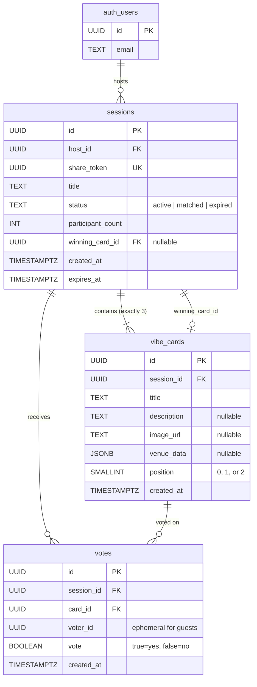

# Database Schema

[← Back to Index](../README.md)

## Entity Relationship Diagram



## Table Definitions

### `sessions`

Represents a Live Session created by an authenticated host.

```sql
CREATE TABLE sessions (
  id            UUID PRIMARY KEY DEFAULT uuid_generate_v4(),
  host_id       UUID NOT NULL REFERENCES auth.users(id) ON DELETE CASCADE,
  share_token   UUID NOT NULL UNIQUE DEFAULT uuid_generate_v4(),
  title         TEXT NOT NULL DEFAULT 'Untitled Session',
  status        TEXT NOT NULL DEFAULT 'active'
                CHECK (status IN ('active', 'matched', 'expired')),
  participant_count INT NOT NULL DEFAULT 1,  -- includes host
  winning_card_id   UUID,                    -- set when consensus reached
  created_at    TIMESTAMPTZ NOT NULL DEFAULT now(),
  expires_at    TIMESTAMPTZ NOT NULL DEFAULT (now() + INTERVAL '24 hours')
);
```

| Column | Type | Description |
|--------|------|-------------|
| `id` | UUID | Primary key, auto-generated |
| `host_id` | UUID | References `auth.users(id)`, the session creator |
| `share_token` | UUID | Unique token used in shareable links |
| `title` | TEXT | Display name for the session |
| `status` | TEXT | `active` → `matched` or `expired` |
| `participant_count` | INT | Total participants including host |
| `winning_card_id` | UUID | Set when consensus is reached |
| `created_at` | TIMESTAMPTZ | Session creation timestamp |
| `expires_at` | TIMESTAMPTZ | Auto-expires after 24 hours |

### `vibe_cards`

Venues or activities that participants vote on. Each session has exactly 3.

```sql
CREATE TABLE vibe_cards (
  id            UUID PRIMARY KEY DEFAULT uuid_generate_v4(),
  session_id    UUID NOT NULL REFERENCES sessions(id) ON DELETE CASCADE,
  title         TEXT NOT NULL,
  description   TEXT,
  image_url     TEXT,
  venue_data    JSONB,
  position      SMALLINT NOT NULL CHECK (position BETWEEN 0 AND 2),
  created_at    TIMESTAMPTZ NOT NULL DEFAULT now(),
  UNIQUE(session_id, position)
);
```

| Column | Type | Description |
|--------|------|-------------|
| `id` | UUID | Primary key, auto-generated |
| `session_id` | UUID | Parent session |
| `title` | TEXT | Card display title (e.g., "Rooftop Bar Downtown") |
| `description` | TEXT | Optional description |
| `image_url` | TEXT | Optional card image |
| `venue_data` | JSONB | Flexible venue metadata (address, rating, price, coordinates) |
| `position` | SMALLINT | Card order: 0, 1, or 2 |

**`venue_data` JSONB structure:**

```json
{
  "address": "123 Main St, City",
  "rating": 4.5,
  "price_level": 2,
  "place_id": "ChIJ...",
  "coordinates": { "lat": 40.7128, "lng": -74.0060 }
}
```

### `votes`

Each vote represents one participant's decision on one card.

```sql
CREATE TABLE votes (
  id            UUID PRIMARY KEY DEFAULT uuid_generate_v4(),
  session_id    UUID NOT NULL REFERENCES sessions(id) ON DELETE CASCADE,
  card_id       UUID NOT NULL REFERENCES vibe_cards(id) ON DELETE CASCADE,
  voter_id      UUID NOT NULL,
  vote          BOOLEAN NOT NULL,
  created_at    TIMESTAMPTZ NOT NULL DEFAULT now(),
  UNIQUE(session_id, card_id, voter_id)
);
```

| Column | Type | Description |
|--------|------|-------------|
| `id` | UUID | Primary key, auto-generated |
| `session_id` | UUID | Parent session |
| `card_id` | UUID | The vibe card being voted on |
| `voter_id` | UUID | Host: `auth.uid()`, Guest: `crypto.randomUUID()` |
| `vote` | BOOLEAN | `true` = swipe right (yes), `false` = swipe left (no) |

> [!IMPORTANT]
> The `UNIQUE(session_id, card_id, voter_id)` constraint ensures one vote per card per person. Upserts are used to allow vote changes.

## Indexes

```sql
-- Sessions
CREATE INDEX idx_sessions_share_token ON sessions(share_token);
CREATE INDEX idx_sessions_host_status ON sessions(host_id, status);

-- Vibe Cards
CREATE INDEX idx_vibe_cards_session ON vibe_cards(session_id);

-- Votes
CREATE INDEX idx_votes_session_card ON votes(session_id, card_id);
CREATE INDEX idx_votes_session_voter ON votes(session_id, voter_id);
```

| Index | Purpose |
|-------|---------|
| `idx_sessions_share_token` | Fast guest lookup when opening a shared link |
| `idx_sessions_host_status` | Host's dashboard: list active sessions |
| `idx_vibe_cards_session` | Load all 3 cards for a session |
| `idx_votes_session_card` | Tally votes per card |
| `idx_votes_session_voter` | Check if a voter has already voted |

## Row Level Security (RLS)

### Sessions

```sql
-- Host has full access to their sessions
CREATE POLICY "Host can manage own sessions"
  ON sessions FOR ALL
  USING (auth.uid() = host_id);

-- Anyone can read sessions (filtered by share_token in app queries)
CREATE POLICY "Anyone can read session by share_token"
  ON sessions FOR SELECT
  USING (true);
```

### Vibe Cards

```sql
-- Anyone can read (guests need to see the cards)
CREATE POLICY "Anyone can read vibe cards"
  ON vibe_cards FOR SELECT USING (true);

-- Only the host can create cards
CREATE POLICY "Host can insert vibe cards"
  ON vibe_cards FOR INSERT
  WITH CHECK (
    EXISTS (
      SELECT 1 FROM sessions
      WHERE sessions.id = vibe_cards.session_id
      AND sessions.host_id = auth.uid()
    )
  );
```

### Votes

```sql
-- Ghost voters: anyone can insert votes (no auth required)
CREATE POLICY "Anyone can insert votes"
  ON votes FOR INSERT WITH CHECK (true);

-- Anyone can read votes (needed for consensus calculation)
CREATE POLICY "Anyone can read votes"
  ON votes FOR SELECT USING (true);
```

> [!NOTE]
> The open INSERT policy on `votes` is intentional for Phase 1. Ghost voters are anonymous by design. Rate limiting and abuse prevention are planned for Phase 2 via Supabase Edge Functions.

## Realtime Publication

```sql
-- Enable Realtime on votes table so Postgres Changes fire
ALTER PUBLICATION supabase_realtime ADD TABLE votes;
```

This single line enables the entire real-time sync engine. When a vote is inserted, Supabase automatically broadcasts the change to all subscribed clients.

## Migration File

The complete migration is at: `supabase/migrations/001_ghost_vote_schema.sql`
