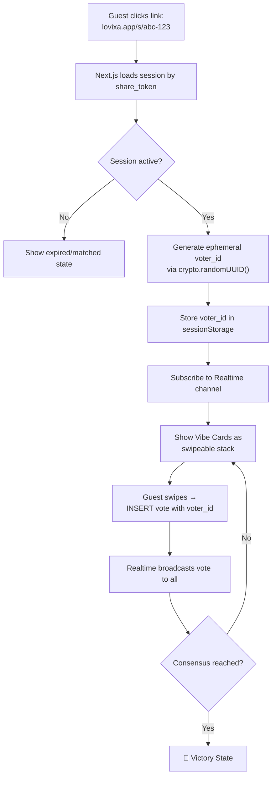

# Guest Flow (Zero-Auth)

[← Back to Index](../README.md)

## Overview

The Guest Flow is what makes Ghost Vote unique — friends can vote without creating an account, downloading an app, or logging in. Everything is ephemeral and frictionless.

## Flow Diagram



## Step-by-Step Breakdown

### 1. Link Entry

The host shares a link like `https://lovixa.app/s/abc-123-def-456`. This routes to:

```
apps/web/src/app/s/[token]/page.tsx
```

The `[token]` is the `share_token` UUID from the `sessions` table.

### 2. Session Loading

The Next.js page fetches the session using the anonymous Supabase client:

```typescript
const { data } = await supabase
  .from('sessions')
  .select('*, vibe_cards(*)')
  .eq('share_token', token)
  .single();
```

### 3. Status Check

| Status | Behavior |
|--------|----------|
| `active` | Proceed to voting |
| `matched` | Show the winning card + Victory State |
| `expired` | Show "This session has expired" message |

### 4. Ephemeral Identity

```typescript
// Generate or retrieve voter ID
let voterId = sessionStorage.getItem('lovixa_voter_id');
if (!voterId) {
  voterId = crypto.randomUUID();
  sessionStorage.setItem('lovixa_voter_id', voterId);
}
```

> [!TIP]
> Using `sessionStorage` (not `localStorage`) means the voter ID is:
> - **Tab-scoped** — Each tab gets its own ID
> - **Ephemeral** — Closing the tab destroys it
> - **No tracking** — No cookies, no fingerprinting, no PII

### 5. Realtime Subscription

The guest subscribes to the session's Realtime channel using the shared `useRealtimeVotes` hook:

```typescript
const { votes, castVote, participants, isConnected } = useRealtimeVotes({
  supabaseUrl: process.env.NEXT_PUBLIC_SUPABASE_URL,
  supabaseAnonKey: process.env.NEXT_PUBLIC_SUPABASE_ANON_KEY,
  sessionId: session.id,
  cards: session.vibe_cards,
  participantCount: session.participant_count,
  voterId,
  onVictory: (result) => router.push(`/victory?card=${result.winning_card_id}`),
});
```

### 6. Swipe Interaction

Guests see the 3 Vibe Cards as a swipeable stack:

- **Swipe Right** → `castVote(cardId, true)` → "Yes, I'm into this"
- **Swipe Left** → `castVote(cardId, false)` → "Nah, pass"

Each swipe inserts a row into the `votes` table, which triggers the Realtime broadcast.

### 7. Victory

When `calculateConsensus()` returns `is_match: true`, the guest is navigated to the Victory State page showing the winning card.

## Security Considerations

| Concern | Mitigation |
|---------|-----------|
| Vote spam | `UNIQUE(session_id, card_id, voter_id)` constraint — one vote per card per ID |
| Multiple tab voting | Each tab gets a new `voter_id` — intentional; prevents gaming by changing votes |
| Session enumeration | `share_token` is a UUID v4 — 2^122 possible values, practically unguessable |
| Data exposure | RLS allows read-only for anonymous users; they can only INSERT votes |
| Stale sessions | Sessions auto-expire after 24 hours |

> [!NOTE]
> Phase 2 will add rate limiting via Supabase Edge Functions to prevent automated abuse.

## Performance Target

The guest web app targets **<1 second TTI** (Time to Interactive):

- Next.js App Router with server components
- Minimal JavaScript bundle (shared packages are tree-shaken)
- No auth overhead (anonymous Supabase client)
- Realtime connection established in parallel with render
