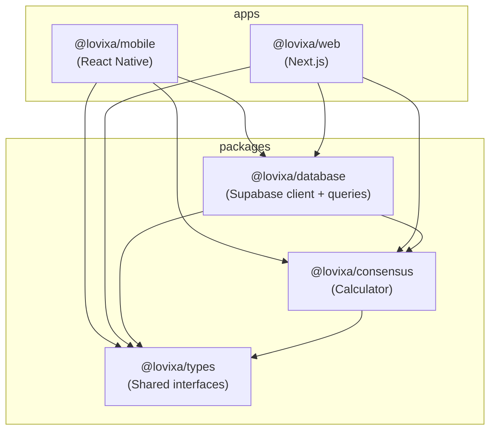

# Monorepo Structure

[← Back to Index](../README.md)

## Turborepo Layout

The project uses **Turborepo** with **npm workspaces** to share code between the mobile host app and the web guest app.

```
lovixa/
├── turbo.json                    # Turborepo pipeline config
├── package.json                  # Root workspace definition
├── packages/
│   ├── types/                    # Shared TypeScript types
│   │   ├── package.json          # @lovixa/types
│   │   ├── tsconfig.json
│   │   └── src/
│   │       ├── index.ts          # Barrel export
│   │       ├── session.ts        # Session, VibeCard, Vote types
│   │       └── consensus.ts      # Consensus algorithm types
│   ├── database/                 # Shared Supabase client + queries
│   │   ├── package.json          # @lovixa/database
│   │   ├── tsconfig.json
│   │   └── src/
│   │       ├── index.ts          # Barrel export
│   │       ├── client.ts         # Supabase client factory
│   │       ├── queries/
│   │       │   ├── sessions.ts   # Session CRUD
│   │       │   ├── vibe-cards.ts # Vibe card queries
│   │       │   └── votes.ts      # Vote casting/fetching
│   │       ├── hooks/
│   │       │   └── useRealtimeVotes.ts  # Shared React hook
│   │       └── realtime/
│   │           └── sync-engine.ts  # Core Realtime subscription logic
│   └── consensus/                # Shared consensus algorithm
│       ├── package.json          # @lovixa/consensus
│       ├── tsconfig.json
│       └── src/
│           ├── index.ts          # Barrel export
│           └── calculator.ts     # Pure math, no side effects
├── apps/
│   ├── mobile/                   # React Native (Expo)
│   │   ├── app.json
│   │   ├── package.json          # @lovixa/mobile
│   │   └── src/
│   │       ├── screens/
│   │       │   ├── CreateSession.tsx
│   │       │   ├── LiveSession.tsx
│   │       │   └── VictoryState.tsx
│   │       ├── components/
│   │       │   └── VibeCard.tsx
│   │       └── hooks/
│   │           └── useRealtimeVotes.ts
│   └── web/                      # Next.js (Guest PWA)
│       ├── next.config.js
│       ├── package.json          # @lovixa/web
│       └── src/
│           ├── app/
│           │   ├── s/[token]/page.tsx   # Guest entry point
│           │   └── victory/page.tsx
│           ├── components/
│           │   └── SwipeCard.tsx
│           └── hooks/
│               └── useRealtimeVotes.ts
└── supabase/
    ├── config.toml
    └── migrations/
        └── 001_ghost_vote_schema.sql
```

## Package Dependency Graph



## Package Details

### `@lovixa/types`

**Purpose:** Single source of truth for all TypeScript interfaces and types.

- Zero runtime dependencies
- Imported by every other package
- Contains: `Session`, `VibeCard`, `Vote`, `ConsensusInput`, `ConsensusResult`

### `@lovixa/consensus`

**Purpose:** Pure consensus calculation logic.

- Depends only on `@lovixa/types`
- No side effects — can run on any platform
- Single export: `calculateConsensus()`

### `@lovixa/database`

**Purpose:** Supabase client factory, database queries, and real-time sync engine.

- Depends on `@lovixa/types`, `@lovixa/consensus`, `@supabase/supabase-js`
- Provides both authenticated and anonymous client factories
- Houses the core `createSyncEngine()` function
- Includes the shared `useRealtimeVotes()` React hook

### `@lovixa/mobile`

**Purpose:** React Native (Expo) host application.

- Depends on all shared packages
- Handles: auth, session creation, link sharing, live voting, Victory State

### `@lovixa/web`

**Purpose:** Next.js guest PWA.

- Depends on all shared packages
- Optimized for `<1s` TTI (Time to Interactive)
- Handles: session loading by token, ephemeral voting, Victory State

## Turborepo Pipeline

```json
{
  "tasks": {
    "build": {
      "dependsOn": ["^build"],
      "outputs": ["dist/**", ".next/**"]
    },
    "dev": {
      "cache": false,
      "persistent": true
    },
    "lint": {
      "dependsOn": ["^build"]
    },
    "type-check": {
      "dependsOn": ["^build"]
    }
  }
}
```

- `^build` ensures packages are built before apps that depend on them
- `dev` is persistent and uncached (live reload)
- `lint` and `type-check` run after builds to ensure types are resolved
