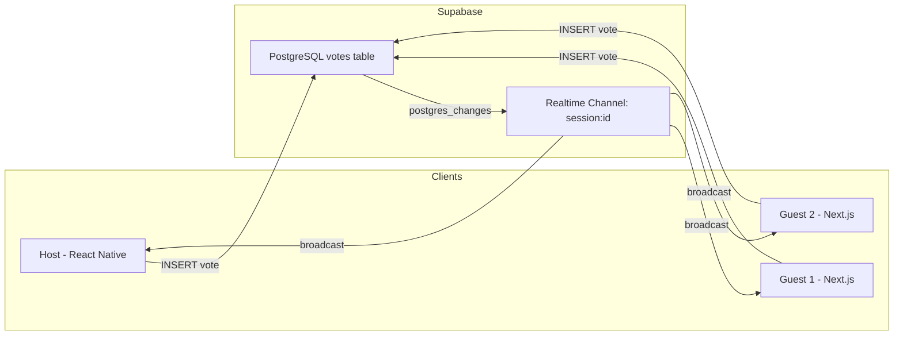

# Realtime Sync Engine

[← Back to Index](../README.md)

## Overview

The sync engine is the heart of Ghost Vote. It uses **Supabase Realtime Postgres Changes** to broadcast vote events to all participants — no custom WebSocket server required.

> [!IMPORTANT]
> Both platforms (React Native host and Next.js guest) subscribe to the same Realtime channel and run the same consensus logic. This guarantees simultaneous Victory State detection.

## Architecture



## How It Works

### Step 1: Channel Creation

Each session gets a dedicated Realtime channel named `session:{session_id}`. This channel handles two concerns:

- **Postgres Changes** — Listens for `INSERT` events on the `votes` table, filtered by `session_id`
- **Presence** — Tracks which participants are currently connected

### Step 2: Vote Subscription

When a client subscribes:

1. **Hydrate** — Fetch all existing votes for the session from the database
2. **Check** — Run `calculateConsensus()` against existing votes (in case consensus was already reached)
3. **Listen** — Subscribe to Postgres Changes for new vote inserts

### Step 3: Vote Processing

On every incoming vote event:

1. **Deduplicate** — Check if the vote already exists in local state
2. **Update** — Add the new vote to the local tally
3. **Calculate** — Run `calculateConsensus()` with the updated vote set
4. **Trigger** — If consensus is reached, trigger Victory State

### Step 4: Consensus Propagation

When consensus is detected:

1. **Navigate** — The detecting client navigates to Victory State immediately
2. **Update DB** — Sets `sessions.status = 'matched'` and `sessions.winning_card_id` (idempotent — only updates if status is still `active`)
3. **Other clients** — Also detect consensus via their own local calculation (happens within ~100ms)

## Sync Engine API

### `createSyncEngine(client, config)`

Factory function that returns a `SyncEngine` instance.

```typescript
interface SyncEngineConfig {
  sessionId: string;
  cardIds: string[];
  participantCount: number;
  voterId: string;
  onVoteReceived: (vote: Vote) => void;
  onConsensusReached: (result: ConsensusResult) => void;
  onParticipantJoined: (count: number) => void;
  onError?: (error: Error) => void;
}

interface SyncEngine {
  subscribe: () => Promise<void>;
  unsubscribe: () => void;
  castVote: (cardId: string, vote: boolean) => Promise<void>;
  channel: RealtimeChannel | null;
}
```

### Usage Example

```typescript
import { createSyncEngine, createAnonymousClient } from '@lovixa/database';

const client = createAnonymousClient(SUPABASE_URL, SUPABASE_ANON_KEY);

const engine = createSyncEngine(client, {
  sessionId: 'abc-123',
  cardIds: ['card-1', 'card-2', 'card-3'],
  participantCount: 4,
  voterId: crypto.randomUUID(),
  onVoteReceived: (vote) => {
    console.log(`${vote.voter_id} voted ${vote.vote ? 'YES' : 'NO'} on ${vote.card_id}`);
  },
  onConsensusReached: (result) => {
    router.push(`/victory?card=${result.winning_card_id}`);
  },
  onParticipantJoined: (count) => {
    setParticipantCount(count);
  },
});

// Start listening
await engine.subscribe();

// Cast a vote (swipe right on card-1)
await engine.castVote('card-1', true);

// Cleanup on unmount
engine.unsubscribe();
```

## Shared React Hook: `useRealtimeVotes`

Both platforms use this hook to integrate the sync engine with React state:

```typescript
const { votes, consensus, participants, castVote, isConnected } = useRealtimeVotes({
  supabaseUrl: SUPABASE_URL,
  supabaseAnonKey: SUPABASE_ANON_KEY,
  sessionId: session.id,
  cards: session.vibe_cards,
  participantCount: session.participant_count,
  voterId: myVoterId,
  onVictory: (result) => navigateToVictory(result),
});
```

| Return Value | Type | Description |
|-------------|------|-------------|
| `votes` | `Vote[]` | All votes received so far |
| `consensus` | `ConsensusResult \| null` | Current consensus state |
| `participants` | `number` | Live participant count via Presence |
| `castVote` | `(cardId, vote) => Promise` | Function to submit a vote |
| `isConnected` | `boolean` | Whether the Realtime channel is active |

## Key Design Decisions

### Why client-side consensus?

- **No server function needed** — Reduces latency and complexity
- **Pure function** — `calculateConsensus()` is deterministic; same inputs always produce same outputs
- **Simultaneous detection** — All clients receive the same vote events and run the same math
- **DB backup** — The first client to detect consensus writes the result to the DB as source of truth

### Why Postgres Changes over Broadcast?

- **Durability** — Votes are persisted in PostgreSQL before being broadcast
- **Late joiners** — New participants can hydrate from the database, then subscribe to live changes
- **No message loss** — Unlike pure broadcast, Postgres Changes are backed by the WAL (Write-Ahead Log)

### Why Presence for participant tracking?

- **No polling** — Supabase Presence automatically tracks connected clients
- **Automatic cleanup** — When a client disconnects, they're removed from the presence state
- **Live count** — The `sync` event fires whenever the participant list changes

## Implementation

See the full implementation at:

- Sync Engine: `packages/database/src/realtime/sync-engine.ts`
- React Hook: `packages/database/src/hooks/useRealtimeVotes.ts`
