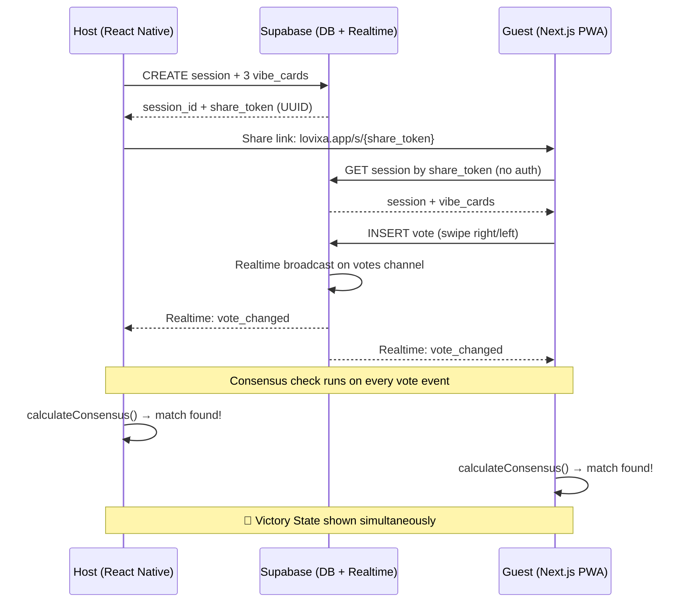

# System Overview

[← Back to Index](../README.md)

## High-Level Architecture

Lovixa Phase 1 is a two-platform system connected by Supabase as the backend and real-time sync layer:

- **Host (React Native)** — Authenticated users create Live Sessions
- **Guest (Next.js)** — Anonymous users vote via a shared link
- **Supabase** — Handles auth, database, and real-time vote broadcasting

## Sequence Diagram



## Platform Responsibilities

### Host (React Native / Expo)

| Responsibility | Details |
|---------------|---------|
| Authentication | Supabase Auth (email/social) |
| Session creation | Create session + insert 3 vibe cards |
| Link generation | Generate shareable `lovixa.app/s/{share_token}` URL |
| Real-time sync | Subscribe to votes channel, track presence |
| Consensus detection | Run `calculateConsensus()` on every vote event |
| Victory display | Navigate to Victory State when match detected |

### Guest (Next.js PWA)

| Responsibility | Details |
|---------------|---------|
| Session loading | Fetch session + cards by `share_token` |
| Identity | Ephemeral `crypto.randomUUID()` in `sessionStorage` |
| Voting | Swipe UI → INSERT into `votes` table |
| Real-time sync | Subscribe to same votes channel as host |
| Consensus detection | Same `calculateConsensus()` function |
| Victory display | Navigate to Victory State when match detected |

### Supabase (Backend)

| Responsibility | Details |
|---------------|---------|
| Auth | Host authentication only (guests are anonymous) |
| Database | PostgreSQL with `sessions`, `vibe_cards`, `votes` tables |
| Realtime | Postgres Changes on `votes` table, Presence for participant tracking |
| RLS | Row Level Security policies for read/write access control |

## Data Flow Summary

```
Host creates session → DB stores session + cards
                     → share_token generated (UUID)
                     → Host shares link

Guest opens link    → Fetches session by token
                    → Generates ephemeral voter_id
                    → Subscribes to Realtime channel

Guest swipes card   → INSERT vote into DB
                    → Postgres Changes fires
                    → All subscribed clients receive event
                    → Each client runs calculateConsensus()
                    → If match → Victory State on all screens
```
