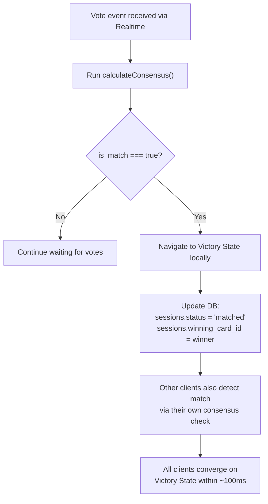

# Victory State

[← Back to Index](../README.md)

## Overview

The Victory State is the climactic moment of a Ghost Vote session — all participants see the winning card simultaneously. This is achieved through client-side consensus detection with no additional server coordination.

## Trigger Flow



## How Simultaneous Detection Works

1. **Same data** — All clients receive the same vote events via Supabase Realtime
2. **Same function** — All clients run the same `calculateConsensus()` pure function
3. **Same result** — Deterministic calculation means all clients reach `is_match: true` at the same time
4. **Timing** — Realtime broadcast latency is typically 20-80ms, so all clients converge within ~100ms

## Database Update (Source of Truth)

When a client detects consensus:

```typescript
await client
  .from('sessions')
  .update({
    status: 'matched',
    winning_card_id: result.winning_card_id,
  })
  .eq('id', sessionId)
  .eq('status', 'active'); // Idempotent: only update if still active
```

The `.eq('status', 'active')` guard ensures:

- Only the **first** client to detect consensus writes the update
- Subsequent clients' updates are no-ops (idempotent)
- No race conditions or duplicate writes

## Late Joiners

If a guest opens the link after consensus has been reached:

1. Session is fetched from the DB
2. `status === 'matched'` → skip voting, show Victory State directly
3. The `winning_card_id` tells the app which card to display

## Victory State UI Components

### Data Available

```typescript
interface VictoryData {
  session: Session;          // The completed session
  winningCard: VibeCard;     // The card that won
  tallies: CardTally[];      // Vote breakdown for all cards
  participantCount: number;  // Total participants
}
```

### Display Elements

| Element | Description |
|---------|-------------|
| Winning Card | Full card display with title, image, description, venue data |
| Consensus % | The winning percentage (e.g., "67% of your group chose this!") |
| Vote breakdown | Visual tally showing yes/no votes per card |
| Participant count | "4 friends voted" |
| Action CTA | "Let's Go!" / "Share Result" / "Start New Session" |

## Edge Cases

| Scenario | Behavior |
|----------|----------|
| Two cards tie above threshold | Highest consensus % wins; if truly tied, first in card order (position) |
| Consensus reached while client is offline | Client detects it on reconnect via vote hydration |
| Session expires before consensus | `status` transitions to `expired`; all clients show expiry state |
| Host leaves during voting | Session continues; guests can still vote and reach consensus |
